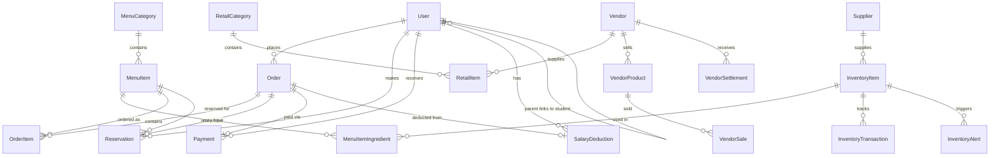

# 🏫 SMS - School Management System

A comprehensive, all-in-one full-stack web application for managing all school operations — from canteen management, library system, user management, to inventory tracking, payment handling, and revenue reporting. Built with **Laravel 12**, **Inertia.js**, **React 19**, and **TypeScript**.

**SMS (School Management System)** consolidates multiple school modules into a single unified platform:

### Available Modules

| Module | Features |
|---|---|
| **🍽️ Canteen** | Menu management, ordering, cart, reservations, QR codes, payments |
| **📦 Inventory** | Stock tracking, auto-deduction, low-stock alerts, transactions |
| **🛒 Retail** | Retail items, vendor management, settlements, quick sell |
| **📚 Library** | Book catalog, borrowing, reservations, fines, reports |
| **💬 Chat** | Direct messaging, conversations, real-time polling |
| **🔔 Notifications** | In-app alerts, read/unread status, polling updates |
| **👥 Users** | CRUD, CSV import, role management, salary deductions |
| **📊 Analytics** | Revenue tracking, trends, exports, faculty deductions |

---

## 📋 Table of Contents

- [Overview](#-overview)
- [Features](#-features)
- [Tech Stack](#-tech-stack)
- [Architecture](#-architecture)
- [Getting Started](#-getting-started)
- [Database Schema](#-database-schema)
- [User Roles & Permissions](#-user-roles--permissions)
- [Module Breakdown](#-module-breakdown)
- [API Routes](#-api-routes)
- [Project Structure](#-project-structure)
- [Seeded Test Data](#-seeded-test-data)
- [Development](#-development)
- [Contributing](#-contributing)
- [License](#-license)

---

## 🌟 Overview

SMS (School Management System) is an all-in-one digital platform that consolidates multiple school operations into a single unified system. It replaces fragmented, paper-based workflows with a streamlined digital solution supporting seven distinct user roles, multiple payment methods, QR-code-based reservations, real-time inventory tracking, library management, and comprehensive staff administration.

### Key Highlights

- **Role-Based Access Control (RBAC)** — 7 roles with isolated dashboards and permissions
- **Complete Order Lifecycle** — Browse menu → Add to cart → Checkout → Pay → Prepare → Serve
- **Smart Inventory** — Auto-deducts raw materials when orders are served, based on ingredient recipes
- **Multi-Payment Support** — GCash, Cash (both confirmed at counter by staff), and Salary Deduction (in-app with limit enforcement for faculty)
- **QR Code Reservations** — Students/faculty reserve meals and present auto-generated QR codes for pickup
- **Revenue Analytics** — Payment method breakdown, daily trends, top selling items, faculty deduction tracking, CSV exports
- **Real-time Notifications** — In-app alerts for orders, payments, inventory, and reservations
- **Chat/Messaging** — Direct messaging between users within the system
- **Retail & Vendor Management** — Manage retail items (biscuits, candies, chocolates) with external vendor settlements
- **Library Management** — Book catalog, borrowing system, reservations, fines management
- **Staff Management** — Employee tracking, salary deductions, department organization

---

## ✨ Features

### 🔐 Authentication & Authorization
- Secure login, registration, and password reset via Inertia.js
- **Dual middleware system**: `RoleMiddleware` for dashboard routing + `PermissionMiddleware` for granular access control
- **19 granular permissions** assigned to 6 roles via a `role_permission` pivot table
- Admin UI for customizing role-permission assignments at runtime
- Smart dashboard redirection — each role lands on their specific dashboard after login
- Session-based authentication with CSRF protection
- Admin role has superuser access (always passes all permission checks)

### 🍲 Menu Management (Admin / Manager)
- Full CRUD for menu items and categories
- Ingredient recipe linking (connects menu items to raw inventory materials)
- **Availability Status Tracking** — Available, Limited (low stock), Sold Out, Hidden
- Stock quantity management with visual indicators
- Allergen tagging and nutritional information
- Image URL support for menu item photos
- Featured item flagging and sort ordering
- **Bulk Import/Export** — CSV-based menu item import and export
- Quick stock adjustment without editing

### 🛒 Ordering System (All Authenticated Users)
- Browse menu with category-organized layout
- Add-to-cart with inline quantity controls on each menu card
- Floating cart panel and sticky checkout bar
- Cart persistence via `localStorage`
- **Sold Out Warning** — Users see warning banners in cart when items become unavailable
- Payment method selection at checkout:
  - **Cash** — Pay at the counter, staff confirms
  - **GCash** — Show transfer at the counter, staff confirms
  - **Salary Deduction** — Faculty only, auto-processed with real-time limit display
- Optional pickup time selection for reservations
- Order notes / special instructions

### 📱 QR Code Reservations
- Auto-generated unique QR codes on order creation (when pickup time is set)
- QR codes displayed on order detail page using `qrcode.react`
- **Reservation Status Workflow** — Pending → Confirmed (on payment) → Redeemed
- Staff redemption via QR code input on the kitchen dashboard
- Expiration tracking (2-hour default window)
- Redemption triggers automatic inventory deduction

### 💰 Payment Processing
- **Cash & GCash**: Staff-confirmed at the counter — identical flow for both
  - GCash reference number capture
  - Cash received amount with automatic change calculation
- **Salary Deduction**: Fully automated in-app processing
  - Monthly limit enforcement per faculty member
  - Running total tracking across the pay period
  - Real-time remaining balance display at checkout

### 📦 Inventory Management (Admin / Manager)
- CRUD for raw material items with SKU, category, and unit tracking
- Stock level monitoring with low-stock and out-of-stock visual indicators
- Manual stock addition with transaction logging
- Supplier linking
- Active alert panel with acknowledgment workflow
- **Auto-deduction**: When an order is served, the system automatically deducts ingredient quantities from inventory based on the `menu_item_ingredients` recipe table

### 🛒 Retail & Vendor Management (Admin / Manager)
- **Retail Categories** — Organize items (Biscuits, Candies, Chocolates, etc.)
- **Retail Items** — Individual products with:
  - Stock tracking and automatic status (Available, Limited, Out of Stock)
  - Optional vendor connection with commission percentage
  - Quick stock adjustment modal
- **External Vendors** — Manage external sellers who sell products in the canteen
  - Contact information (name, phone, email, address)
  - Active/inactive status
  - Product count per vendor
- **Vendor Products** — Products from external vendors with stock management
- **Quick Sell** — Staff can sell vendor products directly
- **End-of-Day Settlements** — Vendor payout workflow:
  - Shows daily sales summary per vendor
  - Calculates vendor share (e.g., 70%) and canteen share (e.g., 30%)
  - Records remaining items to return to vendor
  - Resets vendor product stock after settlement

### 📊 Revenue Dashboard (Admin / Manager)
- Total revenue with order count
- **Average order value** calculation
- Payment method breakdown (GCash / Cash / Salary Deduction) with visual percentage bar
- **Daily revenue trend** visualization (bar chart)
- **Top selling items** ranking (by revenue)
- Date range filtering
- Recent paid orders feed
- Faculty salary deduction usage table with progress bars and near-limit warnings
- CSV export of revenue data

### 👨‍🍳 Kitchen Dashboard (Staff)
- Real-time order queue with status cards (New → Preparing → Ready → Served)
- One-click status progression buttons using Inertia `router.patch()`
- QR code redemption input for reservation pickup
- Payment confirmation modal (GCash reference / cash with change calculation)
- Low-stock inventory alerts panel

### 🔔 Notifications System (All Authenticated Users)
- Real-time in-app notifications for:
  - New orders received
  - Order status changes
  - Payment confirmations
  - Reservation redemptions
  - Low stock alerts
- Polling-based updates via `/api/notifications/poll`
- Mark as read / mark all as read functionality
- Notification type-based styling

### 💬 Chat/Messaging System (All Authenticated Users)
- Direct messaging between any two users
- Conversation-based threading
- Real-time polling for new messages
- Unread message indicators
- Search users to start new conversations
- Message read receipts

### 👥 User Management (Admin / Manager)
- Full CRUD with role-specific form fields:
  - Students: Student ID, grade level, section
  - Faculty: Employee ID, department, salary deduction limit
  - Parents: Linked student account
- CSV bulk import with validation and error reporting
- Search and filter by role
- Active/inactive status management

---

## 🛠️ Tech Stack

| Layer | Technology | Version |
|---|---|---|
| **Backend Framework** | Laravel | 12.x |
| **Frontend Framework** | React | 19.x |
| **Language** | TypeScript | 5.7 |
| **Bridge** | Inertia.js | 2.x |
| **Styling** | Tailwind CSS | 4.x |
| **UI Components** | shadcn/ui (Radix primitives) | — |
| **Icons** | Lucide React | 0.475 |
| **Build Tool** | Vite | 6.x |
| **Database** | MySQL / PostgreSQL / SQLite | — |
| **PHP** | PHP | ≥ 8.2 |

---

## 🏗️ Architecture

The application follows a **modular monolith** architecture pattern:

```
┌─────────────────────────────────────────────────────┐
│                    Browser (React)                    │
│  ┌──────────┐ ┌──────────┐ ┌──────────┐ ┌─────────┐ │
│  │  Menu     │ │  Orders  │ │  Admin   │ │ Kitchen │ │
│  │  Browse   │ │  Cart    │ │  Panels  │ │ Dash    │ │
│  └──────────┘ └──────────┘ └──────────┘ └─────────┘ │
├─────────────────────────────────────────────────────┤
│              Inertia.js (SSR Bridge)                 │
├─────────────────────────────────────────────────────┤
│                 Laravel (PHP)                          │
│  ┌──────────┐ ┌──────────┐ ┌──────────┐ ┌─────────┐ │
│  │  Menu    │ │  Order   │ │  Admin   │ │ Payment │ │
│  │  Module  │ │  Module  │ │  Module  │ │ Module  │ │
│  └──────────┘ └──────────┘ └──────────┘ └─────────┘ │
│  ┌──────────┐ ┌──────────┐ ┌──────────┐ ┌─────────┐ │
│  │Inventory │ │ Revenue  │ │ Retail   │ │ Vendor  │ │
│  │  Module  │ │  Module  │ │  Module  │ │ Module  │ │
│  └──────────┘ └──────────┘ └──────────┘ └─────────┘ │
├─────────────────────────────────────────────────────┤
│          MySQL / PostgreSQL / SQLite Database          │
│  Users · MenuItems · Orders · Inventory · Payments   │
│  RetailItems · Vendors · VendorSettlements           │
└─────────────────────────────────────────────────────┘
```

### Key Design Decisions

1. **Inertia.js** — No REST API needed; server-side controllers return React page components directly with props
2. **Dual Authorization** — `RoleMiddleware` handles dashboard routing; `PermissionMiddleware` enforces granular access per route
3. **Roles + Permissions** — Users have one role → each role maps to N permissions via `role_permission` pivot. Permissions shared to frontend via `HandleInertiaRequests`
4. **Smart Redirect** — `RedirectController` dispatches authenticated users to their role-specific dashboard
5. **Cart in LocalStorage** — Client-side cart state via custom `useCart` hook; persists across page navigations
6. **Cashier-Confirmed Payments** — GCash and Cash are both handled at the physical counter; only salary deduction is processed in-app
7. **Vendor Settlement Flow** — End-of-day workflow for external vendors with sales tracking, commission calculation, and stock return
8. **Service Layer Pattern** — Business logic isolated in Services for testability and reusability
9. **Form Requests** — Centralized validation logic using Laravel Form Request classes
10. **API Resources** — Consistent JSON transformation using Laravel API Resources
11. **Modular Architecture** — Each module (Canteen, Library, Chat, Inventory) is isolated but shares common infrastructure

---

## 🚀 Getting Started

### Prerequisites

- **PHP** ≥ 8.2 with extensions: `pdo`, `mbstring`, `openssl`, `tokenizer`, `xml`
- **Composer** ≥ 2.x
- **Node.js** ≥ 18.x
- **npm** ≥ 9.x
- **MySQL** ≥ 8.0 (or PostgreSQL / SQLite for development)

### Installation

```bash
# 1. Clone the repository
git clone <repository-url>
cd sms

# 2. Install PHP dependencies
composer install

# 3. Install Node.js dependencies
npm install

# 4. Environment setup
cp .env.example .env
php artisan key:generate
```

### Database Configuration

**Option A: SQLite (Quick Start)**
```bash
# SQLite is the default — no extra config needed
touch database/database.sqlite
```

**Option B: MySQL (Recommended for Production)**
```env
# Edit .env
DB_CONNECTION=mysql
DB_HOST=127.0.0.1
DB_PORT=3306
DB_DATABASE=sms
DB_USERNAME=your_username
DB_PASSWORD=your_password
```

### Run Migrations & Seed

```bash
php artisan migrate:fresh --seed
```

This creates all tables and populates sample data including:
- 6 roles with 19 permissions and a default permission matrix
- 6 user accounts (one per role)
- 3 menu items across 2 categories
- 8 inventory items with a supplier
- Ingredient recipe links for auto-deduction
- Sample retail categories and vendor data

### Start Development Server

```bash
# Option 1: Run all services concurrently
composer dev

# Option 2: Run separately in different terminals
php artisan serve        # Backend at http://localhost:8000
npm run dev              # Vite dev server with HMR
```

Visit **http://localhost:8000** in your browser.

---

## 🗄️ Database Schema

### Entity Relationship Overview



### Tables (15+ Migrations)

| Table | Description |
|---|---|
| `users` | All users with role, student/employee IDs, salary deduction fields |
| `roles` | Role definitions (admin, manager, staff, etc.) with display names |
| `permissions` | Permission definitions grouped by feature area |
| `role_permission` | Pivot table mapping roles to their granted permissions |
| `menu_categories` | Menu sections (Main Dishes, Drinks, etc.) |
| `menu_items` | Individual food/drink items with pricing, stock, availability_status |
| `menu_item_ingredients` | Recipe links — maps menu items to inventory raw materials |
| `orders` | Order header with totals, status, payment method |
| `order_items` | Line items within an order |
| `reservations` | QR-coded meal reservations with status (pending → confirmed → redeemed) |
| `payments` | Payment records (GCash ref, cash received, completion time) |
| `salary_deductions` | Faculty salary deduction ledger entries |
| `inventory_items` | Raw materials with stock levels, SKU, supplier |
| `inventory_transactions` | Audit trail of all stock movements |
| `inventory_alerts` | Low-stock and out-of-stock notifications |
| `suppliers` | Supplier contact information |
| `retail_categories` | Categories for retail items (Biscuits, Candies, etc.) |
| `retail_items` | Retail products with optional vendor connection |
| `vendors` | External vendors selling in the canteen |
| `vendor_products` | Products from external vendors |
| `vendor_sales` | Daily sales records for vendor products |
| `vendor_settlements` | End-of-day settlement records |
| `notifications` | User notifications (order, payment, inventory alerts) |
| `conversations` | Chat conversation threads between users |
| `messages` | Individual chat messages with read receipts |

---

## 👤 User Roles & Permissions

The system uses a **Roles + Permissions** architecture. Each user has one role, and each role is assigned a set of granular permissions. Admins can customize role-permission assignments at runtime via the **Roles & Permissions** admin page.

### Roles Overview

| Role | Dashboard | Can Order | Admin Panels | Kitchen | Library |
|---|---|---|---|---|---|
| **Admin** | Overview stats | ✅ | All (superuser) | ❌ | ❌ |
| **Manager** | Overview stats | ✅ | Menu, Retail, Inventory, Revenue | ❌ | ❌ |
| **Librarian** | Library overview | ❌ | Library Management | ❌ | ✅ |
| **Staff** | Kitchen queue | ❌ | ❌ | ✅ | ❌ |
| **Faculty** | Personal orders + deduction info | ✅ (+ salary deduction) | ❌ | ❌ | ✅ |
| **Student** | Personal orders | ✅ | ❌ | ❌ | ✅ |
| **Parent** | Linked student orders | ✅ | ❌ | ❌ | ✅ |

### Default Permission Matrix (20 Permissions)

| Permission | Admin | Manager | Librarian | Staff | Faculty | Student | Parent |
|---|:---:|:---:|:---:|:---:|:---:|:---:|:---:|
| `view_admin_dashboard` | ✅ | ✅ | | | | | |
| `manage_menu` | ✅ | ✅ | | | | | |
| `manage_categories` | ✅ | ✅ | | | | | |
| `manage_users` | ✅ | | | | | | |
| `import_users` | ✅ | | | | | | |
| `manage_inventory` | ✅ | ✅ | | | | | |
| `add_inventory_stock` | ✅ | ✅ | | ✅ | | | |
| `view_revenue` | ✅ | ✅ | | | | | |
| `export_revenue` | ✅ | ✅ | | | | | |
| `manage_deduction_limits` | ✅ | ✅ | | | | | |
| `view_library` | ✅ | ✅ | ✅ | ✅ | ✅ | ✅ | ✅ |
| `manage_library` | ✅ | | ✅ | | | | |
| `view_kitchen` | ✅ | | | ✅ | | | |
| `update_order_status` | ✅ | | | ✅ | | | |
| `confirm_payment` | ✅ | | | ✅ | | | |
| `redeem_reservation` | ✅ | | | ✅ | | | |
| `place_order` | ✅ | ✅ | | | ✅ | ✅ | ✅ |
| `view_own_orders` | ✅ | ✅ | | | ✅ | ✅ | ✅ |
| `use_salary_deduction` | ✅ | | | | ✅ | | |
| `browse_menu` | ✅ | ✅ | ✅ | ✅ | ✅ | ✅ | ✅ |
| `manage_roles` | ✅ | | | | | | |

---

## 📦 Module Breakdown

### Controllers (18 total)

| Controller | Routes | Permission Required |
|---|---|---|
| `RedirectController` | `GET /dashboard` | (auth only) |
| `MenuController` | `GET /menu` | (public) |
| `OrderController` | `/orders/*` | `place_order`, `view_own_orders` |
| `ReservationController` | `/reservations/*` | `view_own_orders` + `redeem_reservation` |
| `PaymentController` | Staff confirm payment | `confirm_payment` |
| `AdminMenuController` | `/admin/menu/*` | `manage_menu`, `manage_categories` |
| `AdminRetailController` | `/admin/retail/*` | `manage_menu` |
| `AdminUserController` | `/admin/users/*` | `manage_users`, `import_users` |
| `InventoryController` | `/admin/inventory/*` | `manage_inventory`, `add_inventory_stock` |
| `RevenueController` | `/admin/revenue/*` | `view_revenue`, `export_revenue` |
| `RolePermissionController` | `/admin/roles/*` | `manage_roles` |
| `NotificationController` | `/notifications/*` | (auth only) |
| `ChatController` | `/chat/*` | (auth only) |
| `SalaryDeductionController` | `/admin/salary-deductions/*` | `manage_deduction_limits` |
| `AdminDashboardController` | `GET /admin/dashboard` | `view_admin_dashboard` |
| `StaffDashboardController` | `GET /staff/dashboard` | `view_kitchen` |
| `FacultyDashboardController` | `GET /faculty/dashboard` | (role: faculty) |
| `CustomerDashboardController` | `GET /customer/dashboard` | (role: student, parent) |

### Models (21 total)

`User` · `Role` · `Permission` · `MenuCategory` · `MenuItem` · `MenuItemIngredient` · `Order` · `OrderItem` · `Reservation` · `Payment` · `SalaryDeduction` · `InventoryItem` · `InventoryTransaction` · `InventoryAlert` · `Supplier` · `RetailCategory` · `RetailItem` · `Vendor` · `VendorProduct` · `VendorSale` · `VendorSettlement` · `Conversation` · `Message`

### React Pages (25+ pages)

```
resources/js/pages/
├── dashboard/
│   ├── admin.tsx          # Admin/Manager overview
│   ├── staff.tsx          # Kitchen order queue + QR scanner
│   ├── faculty.tsx       # Faculty orders + deduction status
│   └── customer.tsx      # Student/Parent order history
├── menu/
│   └── index.tsx         # Public menu with cart + sold out indicators
├── orders/
│   ├── index.tsx        # Order history list
│   ├── create.tsx       # Checkout page with stock warnings
│   ├── show.tsx         # Order detail with QR code
│   └── reservations.tsx # User's reservations
├── admin/
│   ├── menu/
│   │   ├── index.tsx    # Menu item management + stock adjust
│   │   ├── form.tsx     # Create/edit menu item
│   │   └── categories.tsx # Category management
│   ├── retail/
│   │   ├── items.tsx       # Retail items list
│   │   ├── item-form.tsx   # Create/edit retail item
│   │   ├── categories.tsx  # Retail categories
│   │   ├── vendors.tsx    # External vendor management
│   │   ├── vendor-products.tsx # Vendor products
│   │   ├── vendor-product-form.tsx
│   │   ├── quick-sell.tsx  # Staff quick sell page
│   │   └── settlements.tsx # End-of-day vendor settlements
│   ├── users/
│   │   └── index.tsx    # User management + CSV import
│   ├── inventory/
│   │   └── index.tsx   # Stock levels + alerts
│   ├── revenue/
│   │   └── index.tsx   # Revenue dashboard + trends
│   └── roles/
│       └── index.tsx   # Role-permission matrix
├── chat/                 # Messaging system
└── auth/                # Login, Register, Password Reset
```

---

## 🏗️ Service Layer Architecture

The application follows the **Service Layer pattern** to keep controllers thin and business logic reusable.

### Service Layer Pattern

```
┌─────────────────────────────────────────────────────────────┐
│                    Controllers (Thin)                        │
│  - Handle HTTP requests/responses                           │
│  - Validate input using Form Requests                      │
│  - Call Service methods                                    │
│  - Return Inertia responses                               │
└─────────────────────────────────────────────────────────────┘
                              │
                              ▼
┌─────────────────────────────────────────────────────────────┐
│                    Services (Business Logic)                │
│  - BaseService: CRUD operations, filtering, pagination     │
│  - UserService: User CRUD, import, deduction limits        │
│  - OrderService: Order lifecycle, status updates           │
│  - MenuService: Menu items, categories, stock              │
│  - InventoryService: Stock management, alerts              │
│  - DashboardService: Statistics aggregation                │
└─────────────────────────────────────────────────────────────┘
                              │
                              ▼
┌─────────────────────────────────────────────────────────────┐
│                    Models (Data)                            │
│  - Eloquent relationships                                  │
│  - Scopes, accessors, mutators                            │
└─────────────────────────────────────────────────────────────┘
```

### Form Requests

All validation is centralized in Form Request classes:

| Request Class | Purpose |
|---|---|
| `StoreUserRequest` | User creation validation |
| `UpdateUserRequest` | User update validation |
| `StoreMenuItemRequest` | Menu item creation validation |
| `UpdateMenuItemRequest` | Menu item update validation |
| `StoreInventoryItemRequest` | Inventory creation validation |
| `UpdateInventoryItemRequest` | Inventory update validation |
| `AddInventoryStockRequest` | Stock addition validation |

### API Resources

Consistent JSON responses using Laravel API Resources:

| Resource | Purpose |
|---|---|
| `UserResource` | User data transformation |
| `OrderResource` | Order with relations |
| `OrderItemResource` | Order line items |
| `MenuItemResource` | Menu item data |
| `MenuCategoryResource` | Category with items count |
| `UserCollection` | Paginated user list |

### Benefits

- **Testability**: Services can be unit tested in isolation
- **Reusability**: Services can be called from controllers, jobs, or console commands
- **Maintainability**: Business logic is centralized and easy to modify
- **Single Responsibility**: Controllers only handle HTTP; Services handle business logic

---

## 🛣️ API Routes

### Public Routes
| Method | URI | Description |
|---|---|---|
| `GET` | `/menu` | Browse menu (filters out hidden/sold out) |

### Authenticated Routes (All Roles)
| Method | URI | Description |
|---|---|---|
| `GET` | `/dashboard` | Smart redirect to role-specific dashboard |
| `GET` | `/orders` | Order history |
| `GET` | `/orders/create` | Checkout page |
| `POST` | `/orders` | Place order |
| `GET` | `/orders/{order}` | Order detail |
| `GET` | `/reservations` | My reservations |

### Permission-Gated Routes (Key Additions)
| Method | URI | Permission | Description |
|---|---|---|---|
| `GET/POST` | `/admin/menu/export` | `manage_menu` | Export menu CSV |
| `POST` | `/admin/menu/import` | `manage_menu` | Import menu CSV |
| `GET` | `/admin/retail/items` | `manage_menu` | Retail items list |
| `GET` | `/admin/retail/quick-sell` | `manage_menu` | Staff quick sell |
| `GET` | `/admin/retail/settlements` | `manage_menu` | Vendor settlements |
| `POST` | `/admin/retail/settlements` | `manage_menu` | Create settlement |
| `POST` | `/admin/retail/vendor-sales` | `manage_menu` | Record vendor sale |

---

## 📁 Project Structure

```
sms/
├── app/
│   ├── Http/
│   │   ├── Controllers/       # 18 controllers
│   │   ├── Middleware/
│   │   │   ├── RoleMiddleware.php
│   │   │   └── PermissionMiddleware.php
│   │   ├── Requests/
│   │   │   ├── Admin/        # Form Request classes
│   │   │   │   ├── StoreUserRequest.php
│   │   │   │   ├── UpdateUserRequest.php
│   │   │   │   ├── StoreMenuItemRequest.php
│   │   │   │   └── ...
│   │   │   └── Auth/
│   │   └── Resources/         # API Resource classes
│   │       ├── UserResource.php
│   │       ├── OrderResource.php
│   │       └── ...
│   ├── Models/                # 21 Eloquent models
│   ├── Services/              # Business logic layer
│   │   ├── BaseService.php    # Abstract CRUD base
│   │   ├── UserService.php
│   │   ├── OrderService.php
│   │   ├── MenuService.php
│   │   ├── InventoryService.php
│   │   └── DashboardService.php
│   ├── Traits/
│   │   └── HasPermissions.php
│   ├── Notifications/         # Notification classes
│   └── Console/Commands/     # Custom artisan commands
├── database/
│   ├── migrations/           # 15+ migration files
│   ├── seeders/              # RolePermission, User, Menu, Inventory, Retail seeders
│   └── factories/
├── resources/js/
│   ├── components/
│   │   ├── ui/               # shadcn/ui primitives
│   │   ├── stat-card.tsx     # Reusable stat display
│   │   ├── status-badge.tsx  # Status badge variants
│   │   ├── empty-state.tsx   # Empty state display
│   │   └── loading-spinner.tsx
│   ├── hooks/
│   │   ├── use-cart.ts       # Cart state management
│   │   ├── use-notifications.ts
│   │   └── ...
│   ├── lib/
│   │   ├── utils.ts          # Utility functions
│   │   ├── formatters.ts     # Date, price, status formatters
│   │   └── api.ts            # API error handling
│   ├── layouts/              # App layout with sidebar
│   ├── pages/                # All Inertia page components (25+)
│   └── types/
│       └── index.ts           # Full TypeScript interfaces
├── routes/
│   ├── web.php               # All routes (permission-gated)
│   ├── auth.php              # Authentication routes
│   └── settings.php         # User settings routes
└── public/build/             # Compiled production assets
```

---

## 🧪 Seeded Test Data

After running `php artisan migrate:fresh --seed`, the following test data is available:

### User Accounts

| Role | Email | Password |
|---|---|---|
| Admin | `admin@example.com` | `password` |
| Manager | `manager@example.com` | `password` |
| Librarian | `librarian@example.com` | `password` |
| Staff | `staff@example.com` | `password` |
| Faculty | `faculty@example.com` | `password` |
| Student | `student@example.com` | `password` |
| Parent | `parent@example.com` | `password` |

### Menu Items
- **Main Dishes**: Chicken Adobo (₱120), Pork Sinigang (₱150)
- **Drinks**: Iced Lemon Tea (₱45)

### Retail Items (Sample)
- **Biscuits**: Cream Crackers, Skyflakes
- **Candies**: Peppermint, Mints
- **Chocolates**: Chocolate Bar

### Inventory
- 8 raw materials: Rice, Chicken, Pork Belly, Soy Sauce, Vinegar, Cooking Oil, Tea Leaves, Tamarind Mix
- 1 Supplier: Fresh Market Supplies
- Ingredient recipes linked to Chicken Adobo and Pork Sinigang

### Faculty Deduction
- Faculty user has ₱2,000 monthly deduction limit with ₱150 already used

### Roles & Permissions
- 6 system roles with `is_system = true` (cannot be deleted)
- 19 permissions grouped by feature area
- Default permission matrix pre-configured as shown in the Permissions section above

---

## 💻 Development

### Available Scripts

```bash
# Start all dev services (Laravel + Queue + Vite)
composer dev

# Or run individually:
php artisan serve          # PHP dev server at :8000
npm run dev                # Vite HMR at :5173

# Build for production
npm run build

# Code formatting
npm run format             # Format with Prettier
npm run lint               # Lint with ESLint

# Database
php artisan migrate:fresh --seed    # Reset & reseed
php artisan tinker                  # Interactive REPL
php artisan menu:fix-status        # Fix menu availability status
```

### Adding a New Feature

1. **Model**: Create/modify Eloquent model in `app/Models/`
2. **Migration**: `php artisan make:migration create_xyz_table`
3. **Service**: Create service class in `app/Services/` extending `BaseService`
4. **Form Request**: Create validation class in `app/Http/Requests/`
5. **API Resource** (optional): Create resource class in `app/Http/Resources/`
6. **Controller**: Create in `app/Http/Controllers/` and inject Service
7. **Permission**: Add new permission in `RolePermissionSeeder` and assign to roles
8. **Route**: Add to `routes/web.php` with `permission:your_permission` middleware
9. **Types**: Add TypeScript interface to `resources/js/types/index.ts`
10. **Page**: Create React component in `resources/js/pages/`
11. **Components**: Use reusable components from `resources/js/components/`
12. **Formatters**: Add formatting utilities to `resources/js/lib/formatters.ts`
13. **Sidebar**: Check permission in `components/app-sidebar.tsx` to show/hide nav link

### Key Conventions

- **Inertia Rendering**: Controllers return `Inertia::render('page/path', [...props])`
- **Form Submission**: Use `router.post()` / `router.put()` / `router.patch()` from `@inertiajs/react`
- **Validation**: Use Form Request classes in `app/Http/Requests/`; errors auto-propagated to frontend
- **Service Layer**: Inject services in controllers via constructor dependency injection
- **API Resources**: Use resources for consistent JSON transformation in API responses
- **Flash Messages**: `back()->with('success', '...')` for success notifications
- **Error Handling**: Wrap service calls in try-catch blocks with user-friendly messages
- **Currency**: Philippine Peso (₱) — all monetary values stored as `decimal(10,2)`
- **CSV Format**: All imports/exports use standard CSV format with headers in first row
- **Frontend Utils**: Use `lib/formatters.ts` for date/price formatting, `lib/api.ts` for error handling
- **Reusable Components**: Use `components/stat-card.tsx`, `status-badge.tsx`, `empty-state.tsx` for common patterns

---

## 🤝 Contributing

1. Fork the repository
2. Create a feature branch: `git checkout -b feature/my-feature`
3. Commit your changes: `git commit -m 'Add my feature'`
4. Push to the branch: `git push origin feature/my-feature`
5. Open a Pull Request

---

## 📄 License

This project is open-sourced software licensed under the [MIT License](https://opensource.org/licenses/MIT).