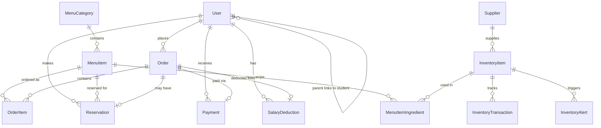

# 🍽️ School Canteen Management System (SMS)

A comprehensive, full-stack web application for managing school canteen operations — from menu management and order processing to inventory tracking, payment handling, and revenue reporting. Built with **Laravel 12**, **Inertia.js**, **React 19**, and **TypeScript**.

---

## 📋 Table of Contents

- [Overview](#-overview)
- [Features](#-features)
- [Tech Stack](#-tech-stack)
- [Architecture](#-architecture)
- [Getting Started](#-getting-started)
- [Database Schema](#-database-schema)
- [User Roles & Permissions](#-user-roles--permissions)
- [Module Breakdown](#-module-breakdown)
- [API Routes](#-api-routes)
- [Project Structure](#-project-structure)
- [Seeded Test Data](#-seeded-test-data)
- [Development](#-development)
- [Contributing](#-contributing)
- [License](#-license)

---

## 🌟 Overview

The School Canteen Management System digitizes the entire canteen workflow for a school environment. It replaces paper-based ordering, manual inventory counts, and cash-only transactions with a streamlined digital platform that supports six distinct user roles, three payment methods, QR-code-based reservations, and real-time inventory tracking with automatic deduction.

### Key Highlights

- **Role-Based Access Control (RBAC)** — 6 roles with isolated dashboards and permissions
- **Complete Order Lifecycle** — Browse menu → Add to cart → Checkout → Pay → Prepare → Serve
- **Smart Inventory** — Auto-deducts raw materials when orders are served, based on ingredient recipes
- **Multi-Payment Support** — GCash, Cash (both confirmed at counter by staff), and Salary Deduction (in-app with limit enforcement for faculty)
- **QR Code Reservations** — Students/faculty reserve meals and present auto-generated QR codes for pickup
- **Revenue Analytics** — Payment method breakdown, faculty deduction tracking, CSV exports

---

## ✨ Features

### 🔐 Authentication & Authorization
- Secure login, registration, and password reset via Inertia.js
- Role-based middleware (`RoleMiddleware`) guards all routes
- Smart dashboard redirection — each role lands on their specific dashboard after login
- Session-based authentication with CSRF protection

### 🍲 Menu Management (Admin / Manager)
- Full CRUD for menu items and categories
- Ingredient recipe linking (connects menu items to raw inventory materials)
- Availability toggling and stock quantity management
- Allergen tagging and nutritional information
- Image URL support for menu item photos
- Featured item flagging and sort ordering

### 🛒 Ordering System (All Authenticated Users)
- Browse menu with category-organized layout
- Add-to-cart with inline quantity controls on each menu card
- Floating cart panel and sticky checkout bar
- Cart persistence via `localStorage`
- Payment method selection at checkout:
  - **Cash** — Pay at the counter, staff confirms
  - **GCash** — Show transfer at the counter, staff confirms
  - **Salary Deduction** — Faculty only, auto-processed with real-time limit display
- Optional pickup time selection for reservations
- Order notes / special instructions

### 📱 QR Code Reservations
- Auto-generated unique QR codes on order creation (when pickup time is set)
- QR codes displayed on order detail page using `qrcode.react`
- Staff redemption via QR code input on the kitchen dashboard
- Expiration tracking (2-hour default window)
- Redemption triggers automatic inventory deduction

### 💰 Payment Processing
- **Cash & GCash**: Staff-confirmed at the counter — identical flow for both
  - GCash reference number capture
  - Cash received amount with automatic change calculation
- **Salary Deduction**: Fully automated in-app processing
  - Monthly limit enforcement per faculty member
  - Running total tracking across the pay period
  - Real-time remaining balance display at checkout

### 📦 Inventory Management (Admin / Manager)
- CRUD for raw material items with SKU, category, and unit tracking
- Stock level monitoring with low-stock and out-of-stock visual indicators
- Manual stock addition with transaction logging
- Supplier linking
- Active alert panel with acknowledgment workflow
- **Auto-deduction**: When an order is served, the system automatically deducts ingredient quantities from inventory based on the `menu_item_ingredients` recipe table

### 👥 User Management (Admin / Manager)
- Full CRUD with role-specific form fields:
  - Students: Student ID, grade level, section
  - Faculty: Employee ID, department, salary deduction limit
  - Parents: Linked student account
- CSV bulk import with validation and error reporting
- Search and filter by role
- Active/inactive status management

### 📊 Revenue Dashboard (Admin / Manager)
- Total revenue with order count
- Payment method breakdown (GCash / Cash / Salary Deduction) with visual percentage bar
- Date range filtering
- Recent paid orders feed
- Faculty salary deduction usage table with progress bars and near-limit warnings
- CSV export of revenue data

### 👨‍🍳 Kitchen Dashboard (Staff)
- Real-time order queue with status cards (New → Preparing → Ready → Served)
- One-click status progression buttons using Inertia `router.patch()`
- QR code redemption input for reservation pickup
- Payment confirmation modal (GCash reference / cash with change calculation)
- Low-stock inventory alerts panel

---

## 🛠️ Tech Stack

| Layer | Technology | Version |
|---|---|---|
| **Backend Framework** | Laravel | 12.x |
| **Frontend Framework** | React | 19.x |
| **Language** | TypeScript | 5.7 |
| **Bridge** | Inertia.js | 2.x |
| **Styling** | Tailwind CSS | 4.x |
| **UI Components** | shadcn/ui (Radix primitives) | — |
| **Icons** | Lucide React | 0.475 |
| **QR Codes** | qrcode.react | — |
| **Build Tool** | Vite | 6.x |
| **Database** | PostgreSQL / SQLite | — |
| **PHP** | PHP | ≥ 8.2 |

---

## 🏗️ Architecture

The application follows a **modular monolith** architecture pattern:

```
┌─────────────────────────────────────────────────────┐
│                    Browser (React)                    │
│  ┌──────────┐ ┌──────────┐ ┌──────────┐ ┌─────────┐ │
│  │  Menu     │ │  Orders  │ │  Admin   │ │ Kitchen │ │
│  │  Browse   │ │  Cart    │ │  Panels  │ │ Dash    │ │
│  └──────────┘ └──────────┘ └──────────┘ └─────────┘ │
├─────────────────────────────────────────────────────┤
│              Inertia.js (SSR Bridge)                 │
├─────────────────────────────────────────────────────┤
│                 Laravel (PHP)                        │
│  ┌──────────┐ ┌──────────┐ ┌──────────┐ ┌─────────┐ │
│  │  Menu    │ │  Order   │ │  Admin   │ │ Payment │ │
│  │  Module  │ │  Module  │ │  Module  │ │ Module  │ │
│  └──────────┘ └──────────┘ └──────────┘ └─────────┘ │
│  ┌──────────┐ ┌──────────┐ ┌──────────┐             │
│  │Inventory │ │ Revenue  │ │ Reserv.  │             │
│  │  Module  │ │  Module  │ │  Module  │             │
│  └──────────┘ └──────────┘ └──────────┘             │
├─────────────────────────────────────────────────────┤
│          PostgreSQL / SQLite Database                 │
│  Users · MenuItems · Orders · Inventory · Payments   │
└─────────────────────────────────────────────────────┘
```

### Key Design Decisions

1. **Inertia.js** — No REST API needed; server-side controllers return React page components directly with props
2. **RBAC via Middleware** — `RoleMiddleware` checks `auth()->user()->role` against route-level role requirements
3. **Smart Redirect** — `RedirectController` dispatches authenticated users to their role-specific dashboard
4. **Cart in LocalStorage** — Client-side cart state via custom `useCart` hook; persists across page navigations
5. **Cashier-Confirmed Payments** — GCash and Cash are both handled at the physical counter; only salary deduction is processed in-app

---

## 🚀 Getting Started

### Prerequisites

- **PHP** ≥ 8.2 with extensions: `pdo`, `mbstring`, `openssl`, `tokenizer`, `xml`
- **Composer** ≥ 2.x
- **Node.js** ≥ 18.x
- **npm** ≥ 9.x
- **PostgreSQL** ≥ 14 (or SQLite for development)

### Installation

```bash
# 1. Clone the repository
git clone <repository-url>
cd sms

# 2. Install PHP dependencies
composer install

# 3. Install Node.js dependencies
npm install

# 4. Environment setup
cp .env.example .env
php artisan key:generate
```

### Database Configuration

**Option A: SQLite (Quick Start)**
```bash
# SQLite is the default — no extra config needed
touch database/database.sqlite
```

**Option B: PostgreSQL (Recommended for Production)**
```env
# Edit .env
DB_CONNECTION=pgsql
DB_HOST=127.0.0.1
DB_PORT=5432
DB_DATABASE=sms
DB_USERNAME=your_username
DB_PASSWORD=your_password
```

### Run Migrations & Seed

```bash
php artisan migrate:fresh --seed
```

This creates all tables and populates sample data including:
- 6 user accounts (one per role)
- 3 menu items across 2 categories
- 8 inventory items with a supplier
- Ingredient recipe links for auto-deduction

### Start Development Server

```bash
# Option 1: Run all services concurrently
composer dev

# Option 2: Run separately in different terminals
php artisan serve        # Backend at http://localhost:8000
npm run dev              # Vite dev server with HMR
```

Visit **http://localhost:8000** in your browser.

---

## 🗄️ Database Schema

### Entity Relationship Overview



### Tables (9 Migrations)

| Table | Description |
|---|---|
| `users` | All users with role, student/employee IDs, salary deduction fields |
| `menu_categories` | Menu sections (Main Dishes, Drinks, etc.) |
| `menu_items` | Individual food/drink items with pricing, stock, allergens |
| `menu_item_ingredients` | Recipe links — maps menu items to inventory raw materials |
| `orders` | Order header with totals, status, payment method |
| `order_items` | Line items within an order |
| `reservations` | QR-coded meal reservations with pickup times |
| `payments` | Payment records (GCash ref, cash received, completion time) |
| `salary_deductions` | Faculty salary deduction ledger entries |
| `inventory_items` | Raw materials with stock levels, SKU, supplier |
| `inventory_transactions` | Audit trail of all stock movements |
| `inventory_alerts` | Low-stock and out-of-stock notifications |
| `suppliers` | Supplier contact information |

---

## 👤 User Roles & Permissions

| Role | Dashboard | Can Order | Admin Panels | Kitchen |
|---|---|---|---|---|
| **Admin** | Overview stats | ✅ | Menu, Users, Inventory, Revenue | ❌ |
| **Manager** | Overview stats | ✅ | Menu, Users, Inventory, Revenue | ❌ |
| **Staff** | Kitchen queue | ❌ | ❌ | ✅ Order status, QR scan, payment confirm |
| **Faculty** | Personal orders + deduction info | ✅ (+ salary deduction) | ❌ | ❌ |
| **Student** | Personal orders | ✅ | ❌ | ❌ |
| **Parent** | Linked student orders | ✅ | ❌ | ❌ |

### Sidebar Navigation by Role

- **Admin / Manager**: Dashboard, Menu Management, Users, Inventory, Revenue, Browse Menu
- **Staff**: Dashboard (Kitchen)
- **Faculty / Student / Parent**: Dashboard, Browse Menu, My Orders, Reservations

---

## 📦 Module Breakdown

### Controllers (14 total)

| Controller | Routes | Access |
|---|---|---|
| `RedirectController` | `GET /dashboard` | All auth |
| `MenuController` | `GET /menu` | Public |
| `OrderController` | `/orders/*` | All auth |
| `ReservationController` | `/reservations/*` | All auth + Staff redeem |
| `PaymentController` | Staff confirm payment | Staff |
| `AdminMenuController` | `/admin/menu/*` | Admin, Manager |
| `AdminUserController` | `/admin/users/*` | Admin, Manager |
| `InventoryController` | `/admin/inventory/*` | Admin, Manager |
| `RevenueController` | `/admin/revenue/*` | Admin, Manager |
| `AdminDashboardController` | `GET /admin/dashboard` | Admin, Manager |
| `StaffDashboardController` | `GET /staff/dashboard` | Staff |
| `FacultyDashboardController` | `GET /faculty/dashboard` | Faculty |
| `CustomerDashboardController` | `GET /customer/dashboard` | Student, Parent |

### Models (13 total)

`User` · `MenuCategory` · `MenuItem` · `MenuItemIngredient` · `Order` · `OrderItem` · `Reservation` · `Payment` · `SalaryDeduction` · `InventoryItem` · `InventoryTransaction` · `InventoryAlert` · `Supplier`

### React Pages (15+ pages)

```
resources/js/pages/
├── dashboard/
│   ├── admin.tsx          # Admin/Manager overview
│   ├── staff.tsx          # Kitchen order queue + QR scanner
│   ├── faculty.tsx        # Faculty orders + deduction status
│   └── customer.tsx       # Student/Parent order history
├── menu/
│   └── index.tsx          # Public menu with cart integration
├── orders/
│   ├── index.tsx          # Order history list
│   ├── create.tsx         # Checkout page
│   └── show.tsx           # Order detail with QR code
├── admin/
│   ├── menu/
│   │   ├── index.tsx      # Menu item management table
│   │   └── form.tsx       # Create/edit menu item form
│   ├── users/
│   │   └── index.tsx      # User management + CSV import
│   ├── inventory/
│   │   └── index.tsx      # Stock levels + alerts
│   └── revenue/
│       └── index.tsx      # Revenue dashboard + charts
└── auth/                  # Login, Register, Password Reset
```

---

## 🛣️ API Routes

### Public Routes
| Method | URI | Description |
|---|---|---|
| `GET` | `/menu` | Browse menu |
| `GET` | `/menu/{menuItem}` | Menu item detail |

### Authenticated Routes (All Roles)
| Method | URI | Description |
|---|---|---|
| `GET` | `/dashboard` | Smart redirect to role-specific dashboard |
| `GET` | `/orders` | Order history |
| `GET` | `/orders/create` | Checkout page |
| `POST` | `/orders` | Place order |
| `GET` | `/orders/{order}` | Order detail |
| `GET` | `/reservations` | My reservations |

### Admin / Manager Routes
| Method | URI | Description |
|---|---|---|
| `GET` | `/admin/dashboard` | Admin dashboard |
| `GET/POST` | `/admin/menu` | List / Create menu items |
| `GET` | `/admin/menu/create` | New item form |
| `GET/PUT` | `/admin/menu/{id}/edit` | Edit item form |
| `DELETE` | `/admin/menu/{id}` | Delete item |
| `PATCH` | `/admin/menu/{id}/toggle` | Toggle availability |
| `GET/POST` | `/admin/categories` | Category management |
| `GET/POST` | `/admin/users` | List / Create users |
| `PUT` | `/admin/users/{id}` | Update user |
| `DELETE` | `/admin/users/{id}` | Delete user |
| `POST` | `/admin/users/import` | CSV bulk import |
| `PATCH` | `/admin/users/{id}/deduction-limit` | Set faculty limit |
| `GET/POST` | `/admin/inventory` | List / Create inventory |
| `PUT` | `/admin/inventory/{id}` | Update item |
| `POST` | `/admin/inventory/{id}/add-stock` | Add stock |
| `PATCH` | `/admin/inventory/alerts/{id}/acknowledge` | Acknowledge alert |
| `GET` | `/admin/revenue` | Revenue dashboard |
| `GET` | `/admin/revenue/export` | Export CSV |

### Staff Routes
| Method | URI | Description |
|---|---|---|
| `GET` | `/staff/dashboard` | Kitchen dashboard |
| `PATCH` | `/staff/orders/{id}/status` | Update order status |
| `POST` | `/staff/orders/{id}/confirm-payment` | Confirm GCash/Cash |
| `POST` | `/staff/reservations/redeem` | Redeem QR code |

---

## 📁 Project Structure

```
sms/
├── app/
│   ├── Http/
│   │   ├── Controllers/       # 14 controllers + Auth/Settings
│   │   └── Middleware/
│   │       └── RoleMiddleware.php   # RBAC enforcement
│   └── Models/                # 13 Eloquent models
├── database/
│   ├── migrations/            # 9 migration files
│   ├── seeders/               # User, Menu, Inventory seeders
│   └── factories/
├── resources/js/
│   ├── components/            # Reusable UI (sidebar, nav, shadcn/ui)
│   ├── hooks/
│   │   └── use-cart.ts        # Cart state management
│   ├── layouts/               # App layout with sidebar
│   ├── pages/                 # All Inertia page components
│   └── types/
│       └── index.ts           # Full TypeScript interfaces
├── routes/
│   ├── web.php                # All application routes
│   ├── auth.php               # Authentication routes
│   └── settings.php           # User settings routes
└── public/build/              # Compiled production assets
```

---

## 🧪 Seeded Test Data

After running `php artisan migrate:fresh --seed`, the following test data is available:

### User Accounts

| Role | Email | Password |
|---|---|---|
| Admin | `admin@example.com` | `password` |
| Manager | `manager@example.com` | `password` |
| Staff | `staff@example.com` | `password` |
| Faculty | `faculty@example.com` | `password` |
| Student | `student@example.com` | `password` |
| Parent | `parent@example.com` | `password` |

### Menu Items
- **Main Dishes**: Chicken Adobo (₱120), Pork Sinigang (₱150)
- **Drinks**: Iced Lemon Tea (₱45)

### Inventory
- 8 raw materials: Rice, Chicken, Pork Belly, Soy Sauce, Vinegar, Cooking Oil, Tea Leaves, Tamarind Mix
- 1 Supplier: Fresh Market Supplies
- Ingredient recipes linked to Chicken Adobo and Pork Sinigang

### Faculty Deduction
- Faculty user has ₱2,000 monthly deduction limit with ₱150 already used

---

## 💻 Development

### Available Scripts

```bash
# Start all dev services (Laravel + Queue + Vite)
composer dev

# Or run individually:
php artisan serve          # PHP dev server at :8000
npm run dev                # Vite HMR at :5173

# Build for production
npm run build

# Code formatting
npm run format             # Format with Prettier
npm run lint               # Lint with ESLint

# Database
php artisan migrate:fresh --seed    # Reset & reseed
php artisan tinker                  # Interactive REPL
```

### Adding a New Feature

1. **Model**: Create/modify Eloquent model in `app/Models/`
2. **Migration**: `php artisan make:migration create_xyz_table`
3. **Controller**: Create in `app/Http/Controllers/`
4. **Route**: Add to `routes/web.php` with appropriate middleware
5. **Types**: Add TypeScript interface to `resources/js/types/index.ts`
6. **Page**: Create React component in `resources/js/pages/`
7. **Sidebar**: Update role navigation in `components/app-sidebar.tsx`

### Key Conventions

- **Inertia Rendering**: Controllers return `Inertia::render('page/path', [...props])`
- **Form Submission**: Use `router.post()` / `router.put()` / `router.patch()` from `@inertiajs/react`
- **Validation**: Server-side validation in controllers; errors auto-propagated to frontend via Inertia
- **Flash Messages**: `back()->with('success', '...')` for success notifications
- **Currency**: Philippine Peso (₱) — all monetary values stored as `decimal(10,2)`

---

## 🤝 Contributing

1. Fork the repository
2. Create a feature branch: `git checkout -b feature/my-feature`
3. Commit your changes: `git commit -m 'Add my feature'`
4. Push to the branch: `git push origin feature/my-feature`
5. Open a Pull Request

---

## 📄 License

This project is open-sourced software licensed under the [MIT License](https://opensource.org/licenses/MIT).
